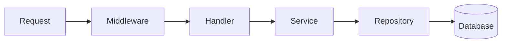

# 🧪 Go User API - Backend Task


A high-performance, production-ready RESTful API built with **Go (Golang)**. This project demonstrates a clean, layered architecture, type-safe database interactions, and robust validation, fully containerized and deployed via CI/CD.

---

## 🚀 Live Demo
**Production URL:** [https://go-user-api-production.up.railway.app/users](https://go-user-api-production.up.railway.app/users)

---

## 🛠️ Tech Stack & Dependencies

I carefully selected the following libraries to build a robust and scalable system:

| Technology | Package | Why I used it? |
| :--- | :--- | :--- |
| **Framework** | [GoFiber](https://gofiber.io/) | Extremely fast, Express-inspired web framework. It simplifies routing and middleware implementation, allowing focus on business logic. |
| **Database** | **PostgreSQL** | Reliable, ACID-compliant relational database. Essential for structured user data. |
| **SQL Generator** | [SQLC](https://sqlc.dev/) | **Crucial Choice.** Instead of an ORM (like GORM), I used SQLC to generate **type-safe Go code** directly from raw SQL queries. This guarantees that my SQL is valid at compile time and runs faster (no reflection). |
| **Driver** | [pgx/v5](https://github.com/jackc/pgx) | High-performance PostgreSQL driver and toolkit. I specifically used `pgxpool` for managing a thread-safe connection pool to the database. |
| **Logging** | [Uber Zap](https://github.com/uber-go/zap) | The built-in `log` package is too simple for production. Zap provides structured, leveled logging (JSON) which is critical for debugging in cloud environments like Railway. |
| **Validation** | [validator](https://github.com/go-playground/validator) | I used struct tags (e.g., `validate:"required"`) to enforce data integrity at the entry level. This prevents bad data from ever reaching the service layer. |
| **Environment** | [godotenv](https://github.com/joho/godotenv) | Manages configuration via `.env` files, keeping secrets safe and separating config from code. |

---

## 🏗️ Architecture & Implementation

I implemented a **Layered Architecture** (Clean Architecture) to ensure separation of concerns and testability.

### 1. The Workflow
Every request follows this path:


### 2. Implementation Details
*   **Database Connection**: In `main.go`, I initialize a `pgxpool` which manages multiple concurrent connections to Postgres. This instance is passed down to the Repository layer.
*   **Dynamic Age Calculation**: The requirement was to *not* store age. In the **Service Layer** (`user_service.go`), I implemented a function that calculates age on-the-fly based on `dob` and `time.Now()`. This ensures the age is always accurate to the usage time.
*   **Pagination**: I implemented offset-based pagination (`LIMIT` and `OFFSET`) in the SQL queries (`users.sql`) and exposed it via the `ListUsers` service, returning metadata like `total_pages` and `current_page`.

---

## 🗂️ Project Structure

```
/cmd/server/main.go      # Entry point: Initializes Config, Logger, DB, and Fiber App.
/config/                 # Config Manager: Loads .env variables.
/db/
  ├── migrations/        # SQL Migrations: Creates the 'users' table.
  ├── queries/           # SQLC Input: Raw SQL queries (users.sql).
  └── sqlc/generated/    # SQLC Output: Auto-generated Go Database code.
/internal/
  ├── handler/           # Controller: Parses HTTP inputs & validates them.
  ├── service/           # Logic: Age calculation & orchestrates data flow.
  ├── repository/        # Data: Interface implementation for DB access.
  ├── routes/            # Router: Maps endpoints to handlers.
  ├── middleware/        # Middleware: Request ID injection & Logging.
  ├── models/            # DTOs: Structs for JSON requests/responses.
  └── logger/            # Logger: Centralized Zap logger setup.
```

---

## ✅ Features & Bonus Completion

| Requirement | Status | Implementation |
| :--- | :---: | :--- |
| **CRUD Operations** | ✅ | Full Create, Read, Update, Delete implemented. |
| **Dynamic Age** | ✅ | Calculated in Service layer using `time` package. |
| **Docker Support** | ✅ | Multi-stage `Dockerfile` (Alpine based) included. |
| **Pagination** | ✅ | `/users?page=1&limit=10` implemented using SQL OFFSET. |
| **Unit Tests** | ✅ | Test suite for Age Calculation logic handling edge cases. |
| **Middleware** | ✅ | `request_id` and `request_duration` logging implemented. |
| **CI/CD** | ✅ | GitHub Actions pipeline runs tests & deploys to Railway. |

---

## 🛠️ Setup & Installation

### Prerequisites
*   Go 1.23+
*   PostgreSQL
*   Git

### 1. Configuration
Copy `.env.example` to `.env` and set your credentials:
```env
DB_HOST=localhost
DB_PORT=5432
DB_USER=postgres
DB_PASSWORD=your_password
DB_NAME=go_user_api
PORT=8080
```

### 2. Run Locally
```bash
go mod download
go run cmd/server/main.go
```

---

## 🔄 API Endpoints & Testing

### 🌍 Option 1: Live Production (Railway)
**Base URL:** [https://go-user-api-production.up.railway.app](https://go-user-api-production.up.railway.app)

#### 1. Create User
```powershell
$body = @{name="Alice"; dob="1990-05-10"} | ConvertTo-Json
Invoke-RestMethod -Method Post -Uri "https://go-user-api-production.up.railway.app/users" -ContentType "application/json" -Body $body
```

#### 2. Get User
```powershell
Invoke-RestMethod -Method Get -Uri "https://go-user-api-production.up.railway.app/users/1"
```

#### 3. List Users
```powershell
Invoke-RestMethod -Method Get -Uri "https://go-user-api-production.up.railway.app/users?page=1&limit=5"
```

#### 4. Update User
```powershell
$bodyUpdate = @{name="Alice Updated"; dob="1991-05-10"} | ConvertTo-Json
Invoke-RestMethod -Method Put -Uri "https://go-user-api-production.up.railway.app/users/1" -ContentType "application/json" -Body $bodyUpdate
```

#### 5. Delete User
```powershell
Invoke-RestMethod -Method Delete -Uri "https://go-user-api-production.up.railway.app/users/1"
```

---

### 🚀 Option 3: Testing with Postman (Recommended)
You can easily test both environments by using Postman Environments.

1.  **Create a Collection** named `Go User API`.
2.  **Add Requests**:
    *   `POST /users` -> Body (JSON): `{"name": "Alice", "dob": "1990-01-01"}`
    *   `GET /users/:id`
    *   `GET /users?page=1&limit=5`
    *   `PUT /users/:id`
    *   `DELETE /users/:id`
3.  **Use Variables**: Replace the domain in the URL with `{{baseUrl}}`.
    *   Example: `{{baseUrl}}/users`
4.  **Create Environments**:
    *   **Local**: Set `baseUrl` = `http://localhost:8080`
    *   **Production**: Set `baseUrl` = `https://go-user-api-production.up.railway.app`
5.  **Switch & Test**: Toggle the environment dropdown in Postman to switch between Local and Production instantly.

---

### 💻 Option 2: Local Development (PowerShell)
**Base URL:** `http://localhost:8080` (Ensure server is running)

#### 1. Create User
```powershell
$body = @{name="Alice"; dob="1990-05-10"} | ConvertTo-Json
Invoke-RestMethod -Method Post -Uri "http://localhost:8080/users" -ContentType "application/json" -Body $body
```

#### 2. Get User
```powershell
Invoke-RestMethod -Method Get -Uri "http://localhost:8080/users/1"
```

#### 3. List Users
```powershell
Invoke-RestMethod -Method Get -Uri "http://localhost:8080/users?page=1&limit=5"
```

#### 4. Update User
```powershell
$bodyUpdate = @{name="Alice Updated"; dob="1991-05-10"} | ConvertTo-Json
Invoke-RestMethod -Method Put -Uri "http://localhost:8080/users/1" -ContentType "application/json" -Body $bodyUpdate
```

#### 5. Delete User
```powershell
Invoke-RestMethod -Method Delete -Uri "http://localhost:8080/users/1"
```
